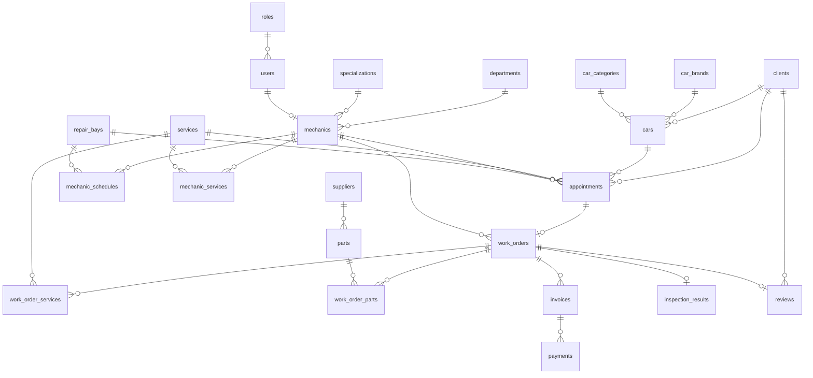

# Проектирование базы данных

Система управления автосервисом. Результат этапа 2 технического задания: состав полей, ключи, ограничения и диаграмма. Схема реализуется миграцией Entity Framework Core в проекте `AutoService.Data`.

Имена таблиц и столбцов в PostgreSQL — латиница в `snake_case`. Классы сущностей лежат в `AutoService.Core`.

## 1. Правила модели

- Первичный ключ каждой самостоятельной таблицы — `id`, целое число, генерируется базой.
- Таблицы связей «многие ко многим» используют составной первичный ключ из двух внешних ключей.
- Все внешние ключи объявлены с `ON DELETE RESTRICT`: удаление записи, на которую есть ссылки, блокируется. Каскадного удаления справочников нет.
- Статусы хранятся текстом и ограничены `CHECK`.
- Деньги — `numeric(12,2)`. Ставка налога — `numeric(5,2)`, в процентах.
- Дата и время — `timestamp without time zone`.
- Пароль пользователя хранится как PBKDF2-SHA256 (100 000 итераций) в формате `итерации.соль.хеш`. Открытый пароль в репозиторий не входит.

Составной внешний ключ записи на обслуживание `(car_id, client_id) → cars (id, client_id)` не даёт привязать к записи чужой автомобиль.

Совпадение клиента отзыва с клиентом записи, допуск механика к услуге, списание остатка запчасти и смена статуса счёта по сумме платежей проверяются в приложении на следующих этапах. В начальных данных остаток запчастей уже указан после списания по завершённому заказу.

## 2. Диаграмма

Связи «многие ко многим» вынесены в таблицы `mechanic_services`, `work_order_services` и `work_order_parts`.

## 3. Таблицы и поля

| Таблица | Назначение по заданию |
|---|---|
| `roles` | Роли пользователей |
| `users` | Пользователи |
| `departments` | Отделы автосервиса |
| `specializations` | Специализации механиков |
| `mechanics` | Механики |
| `clients` | Клиенты |
| `car_brands` | Марки автомобилей |
| `cars` | Автомобили |
| `car_categories` | Категории автомобилей |
| `services` | Услуги |
| `mechanic_services` | Связь механиков с услугами |
| `repair_bays` | Ремонтные места |
| `mechanic_schedules` | Расписание механиков |
| `appointments` | Записи на обслуживание |
| `work_orders` | Заказ-наряды |
| `work_order_services` | Услуги в заказ-нарядах |
| `suppliers` | Поставщики |
| `parts` | Запчасти |
| `work_order_parts` | Запчасти в заказ-нарядах |
| `invoices` | Счета |
| `payments` | Платежи |
| `inspection_results` | Результаты технического осмотра |
| `reviews` | Отзывы клиентов |

### 3.1. Сотрудники

`roles`: `id`, `name` уникально. Значения: Администратор, Механик, Руководитель.

`users`: `id`, `role_id`, `full_name`, `login` уникально, `password_hash`.

`departments`: `id`, `name` уникально.

`specializations`: `id`, `name` уникально.

`mechanics`: `id`, `user_id` уникально, `department_id`, `specialization_id`. Строка есть только у сотрудника с ролью механика.

### 3.2. Клиенты и автомобили

`clients`: `id`, `full_name`, `phone`, `email`. Поиск идёт по имени, телефону и почте. `email` уникален, пустое значение допустимо. Индекс по `full_name` нужен для сортировки по алфавиту.

`car_brands`: `id`, `name` уникально.

`car_categories`: `id`, `name` уникально.

`cars`: `id`, `client_id`, `car_brand_id`, `car_category_id`, `model`, `manufacture_year`, `vin`, `license_plate`, `mileage`, `color`, `notes`.

Ограничения: год от 1970 до 2100, пробег не меньше 0, VIN ровно 17 символов. Уникальны `vin` и `license_plate`. Уникальна пара `(id, client_id)` — на неё ссылается запись на обслуживание. Индекс по `mileage` нужен для сортировки.

`color` и `notes` хранят прочие характеристики автомобиля.

### 3.3. Услуги, посты и склад

`services`: `id`, `name`, `description`, `base_price`, `duration_minutes`. Цена не меньше 0, длительность больше 0. Индексы по цене и длительности нужны для фильтрации и сортировки.

`mechanic_services`: `mechanic_id`, `service_id`. Составной первичный ключ.

`repair_bays`: `id`, `name` уникально, `kind`. Вид места: Подъёмник, Диагностический пост, Шиномонтажная зона, Кузовной участок.

`mechanic_schedules`: `id`, `mechanic_id`, `repair_bay_id`, `starts_at`, `ends_at`. Окончание позже начала.

`suppliers`: `id`, `name`, `phone`, `email`.

`parts`: `id`, `supplier_id`, `name`, `sku` уникально, `purchase_price`, `sale_price`, `quantity`, `min_quantity`. Цены и количества не меньше 0. Индекс по `quantity` нужен для фильтра по остатку.

### 3.4. Запись, заказ и осмотр

`appointments`: `id`, `client_id`, `car_id`, `service_id`, `mechanic_id`, `repair_bay_id`, `scheduled_at`, `status`.

Статусы: Запланирована, Подтверждена, Отменена, Выполнена. Индексы по дате и статусу.

`work_orders`: `id`, `appointment_id` уникально, `mechanic_id`, `created_at`, `status`, `fault_description`. У одной записи не больше одного заказ-наряда.

Статусы: Создан, Диагностика, В ремонте, Завершён, Отменён. Индексы по дате создания и статусу.

`work_order_services`: `work_order_id`, `service_id`, `price`. Составной первичный ключ. `price` — стоимость услуги в этом заказе, не меньше 0.

`work_order_parts`: `work_order_id`, `part_id`, `quantity`, `unit_price`. Составной первичный ключ. Количество больше 0, цена не меньше 0. `unit_price` — продажная цена на момент списания.

`inspection_results`: `id`, `work_order_id` уникально, `engine_state`, `brake_state`, `suspension_state`, `electrical_state`, `recommendations`. У заказ-наряда не больше одного результата осмотра.

### 3.5. Счета, платежи и отзывы

`invoices`: `id`, `work_order_id`, `created_at`, `amount_before_discount`, `discount`, `tax_rate`, `tax`, `total`, `status`.

Статусы: Выставлен, Частично оплачен, Оплачен.

Формулы, закреплённые ограничением:

- скидка от 0 до суммы до скидки;
- ставка налога от 0 до 100;
- `tax = round((amount_before_discount - discount) * tax_rate / 100, 2)`;
- `total = amount_before_discount - discount + tax`.

`payments`: `id`, `invoice_id`, `paid_at`, `amount`, `method`, `status`, `transaction_number`. Сумма больше 0. Способ: Наличные, Карта, Перевод. Статус: Проведён, Отменён. Один счёт связан со многими платежами.

`reviews`: `id`, `client_id`, `work_order_id` уникально, `rating`, `comment`, `created_at`. Оценка от 1 до 5. У заказ-наряда не больше одного отзыва.

## 4. Что попадает в начальные данные

Миграция сразу заполняет базу:

- три роли и учётные записи `admin`, `mechanic`, `mechanic2`, `chief`;
- два отдела, две специализации, два механика;
- два клиента, три автомобиля (у первого клиента две машины), две марки и две категории;
- три услуги и допуск механиков к ним: первый механик выполняет замену масла и диагностику, второй — диагностику и замену колодок;
- два ремонтных места и три интервала расписания;
- два поставщика и три запчасти, у тормозных колодок остаток ниже минимального;
- завершённая цепочка за 15.09.2026: запись «Выполнена», заказ-наряд «Завершён», осмотр, счёт на 5400,00 (сумма 5000,00, скидка 500,00, налог 20% = 900,00), платёж на всю сумму, отзыв;
- запись на 20.10.2026 со статусом «Запланирована», без заказ-наряда.
